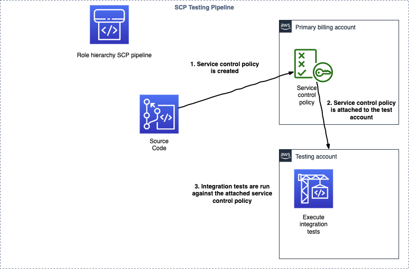

To deploy you will need AWS Organizations setup. You should also have a separate testing/sandbox account in which to run the integration tests which require attaching the SCP to the testing account.

In your primary billing account
```
cdk bootstrap
```

In your testing account
```
cdk bootstrap --trust PRIMARY_BILLING_ACCOUNT_NUMBER_HERE --cloudformation-execution-policies arn:aws:iam::aws:policy/AdministratorAccess
```

In your primary billing account, create a code commit repo and push this repo. Make sure you have the AWS CodeCommit credential helper [installed](https://docs.aws.amazon.com/codecommit/latest/userguide/setting-up-https-unixes.html).

```
pushd ../../dependencies/codecommit/
cdk deploy
./push.sh
popd
```

Then, deploy the service control policy testing pipeline in your primary billing account.
```
cdk deploy
```


